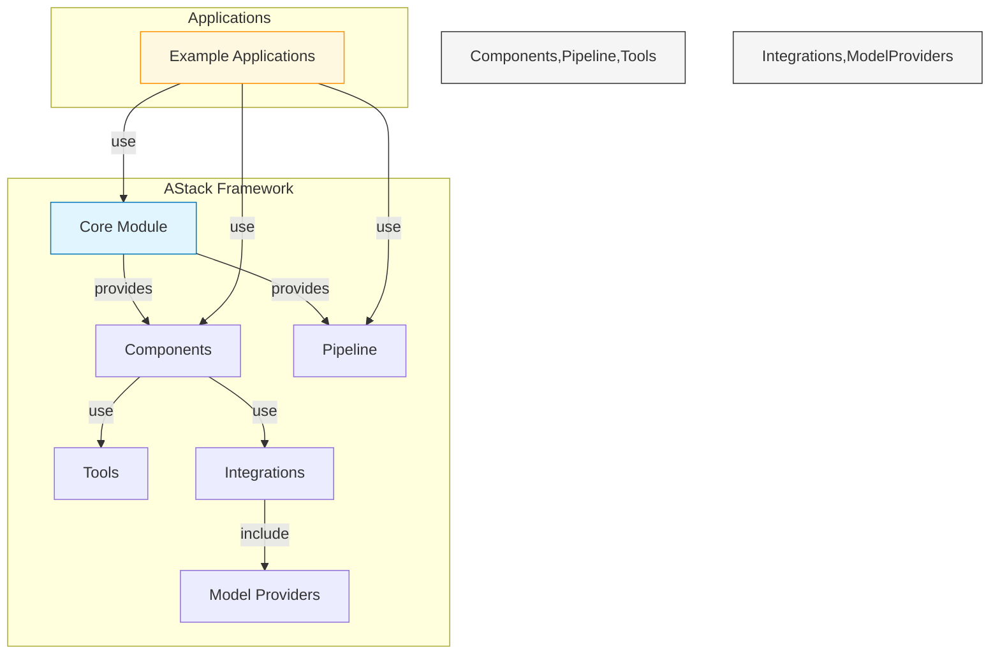
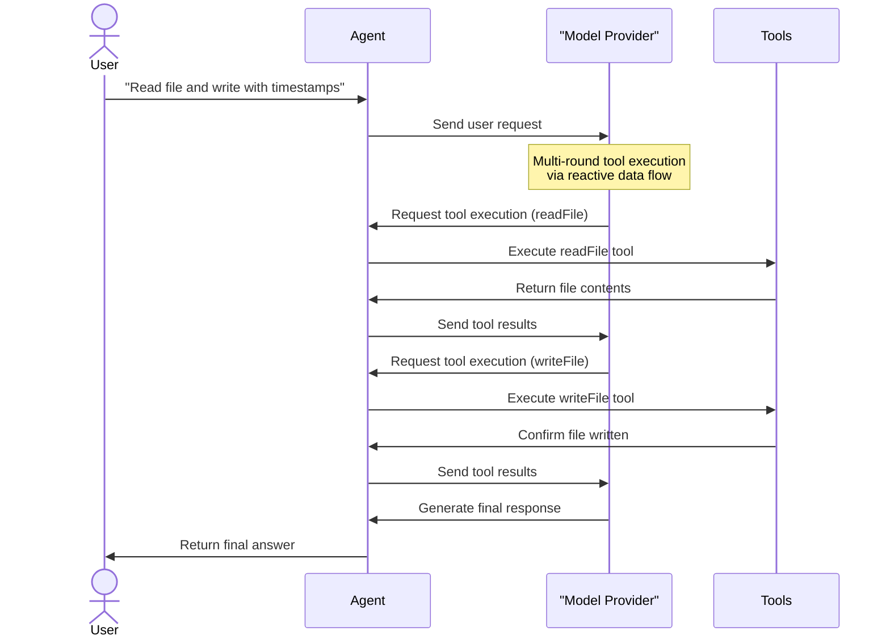
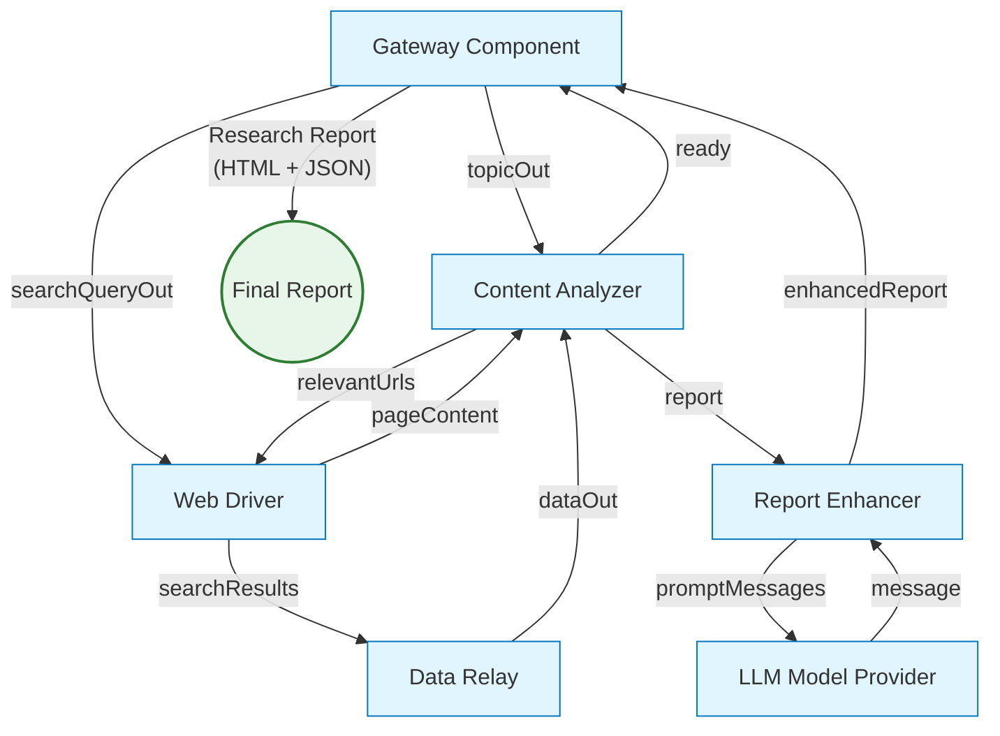
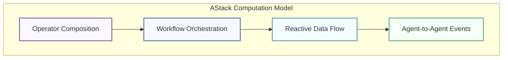
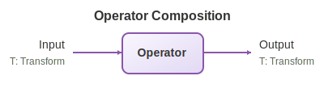
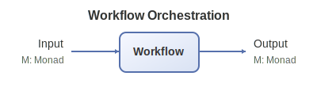
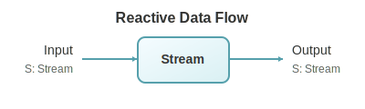
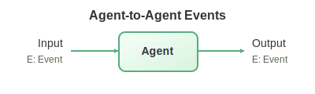
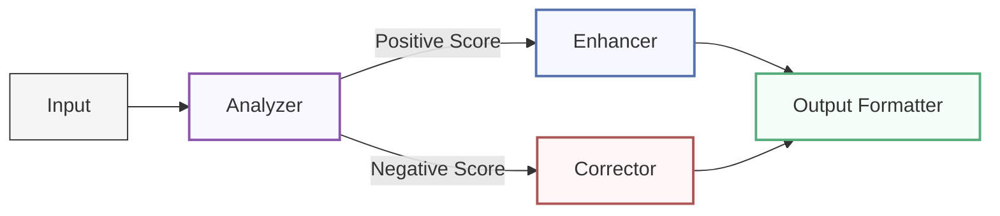
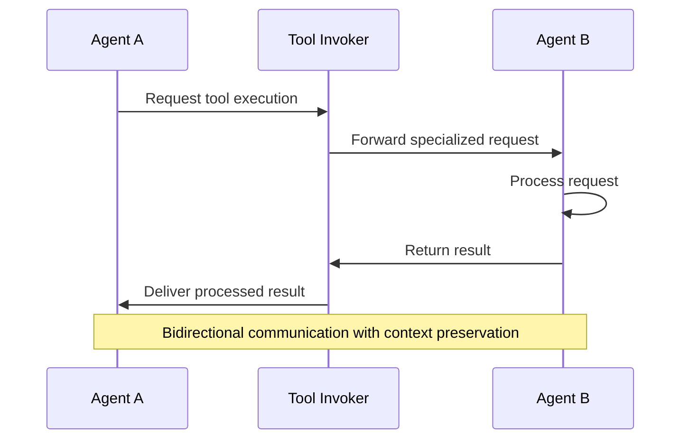

<div align="center">


# AStack

**A composable framework for building AI applications**

[](LICENSE)
[](https://github.com/astack-tech/astack/pulls)
[](https://deepwiki.com/astack-tech/astack)

🎉 **Beta Version Released** 🎉

*AStack is under active development but already provides significant value for building AI applications*

English | [简体中文](./README.zh-CN.md)

</div>

## 📋 Overview

AStack is a composable framework designed to simplify the development of AI applications through a "everything is a component" philosophy. Built on reactive data flow principles, it enables seamless integration between various AI models, tools, and custom business logic through event-driven execution.

AStack is an independent technical framework with its own architecture and ecosystem, built on top of [Hlang](https://github.com/hlang-tech) - a highly semantic [fourth-generation language (4GL)](https://en.wikipedia.org/wiki/Fourth-generation_programming_language) inspired by Flow-Based Programming paradigms. This foundation on Hlang, which is particularly well-suited for computational modeling and AI-generated code, is what gives AStack its power. The framework emphasizes minimalism and performance, allowing developers to create complex systems with minimal boilerplate code while maintaining complete technical autonomy.

### Key Features

- **Component-Based Architecture**: Build complex AI systems by composing simple, reusable components
- **Reactive Data Flow**: Built on RxJS Observable with publish-subscribe pattern, enabling decoupled component communication
- **Event-Driven Execution**: Data-driven automatic triggering based on Flow-Based Programming paradigm
- **Lock-Free Concurrency**: Multiple data packets flow through the pipeline simultaneously without manual lock management
- **Pipeline Execution Model**: Support for both independent and pipeline execution modes
- **Extensible Tool System**: Easily integrate new capabilities through a unified tool interface
- **Multi-Model Support**: Seamless integration with various LLM providers
- **Declarative Workflow**: Define complex AI workflows with minimal code
- **Minimalist API Design**: Focus on simplicity and expressiveness

## 👁 Design Philosophy

AStack is built on several core philosophical principles that guide its development:

### Everything is a Component

In AStack, everything from a simple tool to a complex agent is represented as a component. This unified approach simplifies development and promotes code reuse. Components can be composed, extended, and reconfigured to suit various use cases.

### Data Flow Paradigm for Agent Frameworks

AStack embraces a **data flow** architecture rather than a **control flow** approach - a fundamental shift that aligns with how LLMs actually work. Traditional agent frameworks often attempt to "control" the model through complex control flow logic, but this is a conceptual mismatch.

LLMs are stateless generators, not stateful programs. Agent state doesn't align with program state. The agent framework should serve as an **interpreter** for model output, treating the model as a data generator rather than a controllable component.

This data flow paradigm offers several advantages:
- **Natural Alignment**: Matches the stateless, generative nature of LLMs
- **Simplified Architecture**: Eliminates complex control flow logic trying to "manage" the model
- **Better Scalability**: Data flow naturally supports concurrent, event-driven processing
- **Reduced Complexity**: Avoids the bloat of control-flow frameworks (some have 11k+ line single files)

AStack's reactive data flow is built on Flow-Based Programming principles using RxJS Observables, where components communicate through publish-subscribe patterns. This enables:
- **Event-Driven Execution**: Components react to data events, not control signals
- **Lock-Free Concurrency**: Multiple data packets flow simultaneously without explicit locking
- **Decoupled Communication**: Components don't need to know about each other's implementation

### Minimalism Over Complexity

AStack prioritizes simple, intuitive APIs over complex abstractions. This minimalist approach leads to more maintainable code and a gentler learning curve.

## 🎯 Use Cases

AStack is particularly well-suited for:

- **AI Agents**: Build autonomous agents that can reason, plan, and execute tasks using tools
- **Content Generation**: Create pipelines for researching, analyzing, and generating high-quality content
- **Data Processing**: Construct workflows for extracting, transforming, and analyzing data
- **Multi-modal Applications**: Develop applications that combine text, images, and other modalities
- **Research Platforms**: Build experimental platforms for AI research and development

## 👏 Inspiration & Comparison

AStack draws inspiration from several outstanding projects in the AI ecosystem, particularly [Haystack](https://github.com/deepset-ai/haystack) by deepset-ai. We express our gratitude to these projects for their pioneering work and contributions to the open-source community.

> **Important Note**: AStack is a 100% original framework with its own independent technical implementation, architecture, and design. It is built in TypeScript and only shares API style inspiration with Haystack (which is implemented in Python). AStack is not a fork or derivative of Haystack.

### AStack vs. Haystack: Technical Comparison

> This comparison is based on Haystack v2.0 (as of January 2026). Both frameworks continue to evolve, and specific features may change over time.

| Feature | AStack | Haystack |
|---------|--------|----------|
| **Core Paradigm** | Data flow (FBP) - reactive, event-driven | Control flow - imperative, while-loop scheduling |
| **Execution Model** | RxJS Observable streams with publish-subscribe | Priority queue with dict-based data passing |
| **Concurrency** | Lock-free concurrent execution (FBP paradigm) | Manual async management with priority levels |
| **Data Passing** | Reactive streams through port connections | Dict deepcopy between components |
| **Topology Optimization** | Built once per route, reused for all executions | Topological sort on each run |
| **Type Safety** | Compile-time TypeScript type checking | Runtime Python type compatibility checking |
| **Primary Focus** | General AI application framework with data flow paradigm | Primarily NLP and RAG applications |
| **Agent Philosophy** | LLM as stateless generator (interpreter pattern) | Traditional agent control patterns |
| **Component Interface** | Unified component interface with port system | Different interfaces based on component types |
| **Debugging Tools** | Standard TypeScript debugging | Rich debugging (breakpoints, snapshots, tracing) |
| **Memory Management** | Built-in memory abstractions | Memory implemented through specialized components |
| **Tool Integration** | Standardized tool interface | Various integration patterns depending on use case |
| **Learning Curve** | Minimalist API focused on simplicity | Comprehensive but more complex API |
| **Implementation** | **TypeScript** | **Python** |
| **Ecosystem Maturity** | Growing ecosystem | Mature Python ecosystem with production validation |
| **Chinese Support** | **Complete Chinese documentation** | **Limited Chinese documentation** |

**Key Architectural Differences:**

- **Data Flow vs Control Flow**: AStack's reactive data flow paradigm aligns naturally with LLMs as stateless generators, while Haystack uses traditional control flow patterns with while-loop scheduling
- **Concurrency Model**: AStack achieves lock-free concurrency through FBP's event-driven model; Haystack manages concurrency through priority queues and manual async handling
- **Performance Optimization**: AStack builds topology once and reuses it; Haystack performs topological sorting on each execution
- **Type System**: AStack provides compile-time safety through TypeScript; Haystack offers runtime checking with optional validation

Each framework has its strengths and is optimized for different use cases. Haystack excels in RAG applications and document processing with mature Python ecosystem and rich debugging tools, while AStack is designed for TypeScript/JavaScript environments with emphasis on reactive data flow, event-driven execution, and the data flow paradigm that naturally fits Agent framework requirements. AStack also offers full Chinese language documentation, making it particularly accessible to Chinese-speaking developers.

## 🔍 Architecture



## 🚀 Getting Started

### Prerequisites

- Node.js (v18 or higher)
- npm or pnpm

### Installation

```bash
# Clone the repository
git clone https://github.com/astack-tech/astack.git
cd astack

# Install dependencies
pnpm install

# Build the packages
pnpm run build
```

### Examples Directory

AStack includes several examples in the `examples/` directory to demonstrate its capabilities. Each example contains its own README with specific instructions on how to run it with your own API keys and configuration.

## 📚 Examples

### Agent with Tools

This example demonstrates how to create an Agent that can use tools to perform real-world tasks like file operations. It showcases AStack's reactive data flow where components communicate through event-driven port connections.



This example highlights AStack's ability to handle multi-round tool execution, where the agent can process multiple tool calls within a single conversation, maintaining context throughout the interaction.

### Research Pipeline

This example demonstrates a sophisticated research pipeline that automatically searches for information, analyzes content, and generates comprehensive research reports using AI. It showcases AStack's ability to coordinate complex workflows across multiple components.



The pipeline intelligently coordinates web searches, content extraction, and AI-powered analysis to produce in-depth research reports on any topic, complete with proper citations and structured sections.

## 💻 Code Examples

### Creating a Simple Agent with Tools

```typescript
import { Agent } from '@astack-tech/components';
import { createTool } from '@astack-tech/tools';
import { Deepseek } from '@astack-tech/integrations/model-provider';

// Define tools
const readFileTool = createTool(
  'readFile',
  'Read file contents',
  async ({ filePath }) => {
    // Implementation details
    return fileContents;
  }
);

// Create model provider
const model = new Deepseek({
  apiKey: process.env.DEEPSEEK_API_KEY,
  model: 'deepseek-chat'
});

// Create Agent
const agent = new Agent({
  model,
  tools: [readFileTool],
  systemPrompt: 'You are a helpful assistant that can read files.'
});

// Run the agent
const result = await agent.run('Please read the README.md file');
```

### Building a Pipeline

AStack's refactored Pipeline provides intelligent execution with three flexible modes:

```typescript
import { Pipeline } from '@astack-tech/core';
import { TextSplitter, Embedder, VectorStore } from '@astack-tech/components';

// Create pipeline
const pipeline = new Pipeline();

// Add components
pipeline.addComponent('splitter', new TextSplitter());
pipeline.addComponent('embedder', new Embedder());
pipeline.addComponent('store', new VectorStore());

// Connect components - direct port connections
pipeline.connect('splitter.out', 'embedder.in');
pipeline.connect('embedder.out', 'store.in');

// Mode 1: Auto-infer endpoint (detects single leaf port)
const result = await pipeline.run('splitter.in', document);

// Mode 2: Explicit endpoint
const result = await pipeline.run('splitter.in', document, 'store.out');

// Mode 3: Multi-output collection (type-safe)
const results = await pipeline.run('splitter.in', document, {
  includeOutputsFrom: ['embedder.out', 'store.out']
});
// Returns: { 'embedder.out': T, 'store.out': T }
```

**Pipeline Features:**
- **Smart Topology Optimization**: Each route builds topology once, reuses for subsequent executions
- **Three Execution Modes**: Auto-inference, explicit endpoint, or multi-output collection
- **Type-Safe Multi-Output**: Full TypeScript type inference for collected outputs
- **Concurrent Execution**: Resolver queue manages multiple concurrent pipeline runs

## 🔄 Hlang Compatibility

While AStack is a technically independent framework, it offers seamless compatibility with [Hlang](https://github.com/hlang-tech) - a framework inspired by Flow-Based Programming (FBP) paradigm with features particularly well-suited for AI application development. This technical compatibility offers unique advantages:

### Hlang's Distinctive Features

[Hlang](https://github.com/hlang-tech) offers several distinctive concepts that are valuable for modern software development, especially for AI applications:

- **Declarative Programming Approach**: Express complex behaviors in a fraction of the code required by traditional methods
- **Human-Centric Design**: Intuitive syntax that reduces the learning curve for developers
- **Component-Based Architecture**: Built around composable components that can be assembled into complex systems
- **Type Safety with Flexibility**: Strong typing system that also accommodates the dynamic nature of modern applications

### Technical Integration

AStack maintains complete technical autonomy while offering compatibility with Hlang:

- **Compatible Component Models**: AStack's component approach is structurally compatible with Hlang's flow-based programming model
- **Independent Development**: AStack can be used independently or in conjunction with Hlang's capabilities
- **Complementary Strengths**: Combine AStack's fine-grained component control with Hlang's higher-level abstractions
- **Efficient Execution**: AStack's reactive data flow design enables efficient implementation of workflows defined in either framework

This technical compatibility creates a practical synergy for developers leveraging both frameworks' strengths while maintaining the independence of each system.

## 🧩 Powerful Computation Model

AStack implements a sophisticated computation model based on monadic functional programming paradigms inspired by Hlang. This model provides powerful abstractions that enable complex workflows, reactivity, and compositional architecture while maintaining simplicity and flexibility.

### Four Core Computation Patterns

AStack's computation model is built around four powerful patterns that can be combined to create sophisticated AI applications:



| Computation Pattern | Description | Diagram |
|---------------------|-------------|--------|
| **Operator Composition** | Each component is a composable transformation operator with pure functional interfaces. Components maintain clear input/output contracts and can be chained together seamlessly. |  |
| **Workflow Orchestration** | Components can be orchestrated into complex workflows with branching, joining, and conditional execution paths, enabling dynamic routing and parallel processing. |  |
| **Reactive Data Flow** | Implements an event-driven asynchronous data processing model where components respond to data events rather than polling, supporting backpressure handling. |  |
| **Agent-to-Agent Events** | Support for complex interactions and message passing between agents, maintaining context continuity across multiple exchanges, enabling multi-agent coordination. |  |

#### 1. Operator Composition

The fundamental building block of AStack is operator composition, where each component is a transformational operator that can be composed with others.

```typescript
// Simple operator composition example
const textProcessor = new TextProcessor();
const sentimentAnalyzer = new SentimentAnalyzer();

// Connect output of textProcessor to input of sentimentAnalyzer
pipeline.connect('textProcessor.out', 'sentimentAnalyzer.in');
```

| Feature | Description |
|---------|-------------|
| **Functional Purity** | Components are designed as pure transformations with clear inputs and outputs |
| **Composition Pattern** | Components can be linked together with their outputs feeding into inputs of other components |
| **Type Safety** | The port system ensures type compatibility between connected components |
| **Transparent Data Flow** | Data flow between components is explicit and traceable |

#### 2. Workflow Orchestration

Components can be orchestrated into complex workflows with branching, joining, and conditional execution paths.



| Feature | Description |
|---------|-------------|
| **Dynamic Routing** | Data can be conditionally routed between components based on content or metadata |
| **Parallel Processing** | Multiple pathways can execute simultaneously for efficient processing |
| **Pipeline Construction** | Complex workflows can be built incrementally and modified at runtime |
| **Error Handling** | Built-in mechanisms for handling and recovering from errors within the workflow |

#### 3. Reactive Data Flow

AStack implements a reactive programming model where data flows through the system in response to events or changes.

```typescript
// Reactive component example
class ReactiveProcessor extends Component {
  constructor() {
    super({});
    Component.Port.I('in').attach(this);
    Component.Port.O('out').attach(this);
  }

  _transform($i, $o) {
    // Listen for data on input port
    $i('in').receive(data => {
      // Process data reactively
      const result = this.process(data);
      // Send to output port
      $o('out').send(result);
    });
  }
}
```

| Feature | Description |
|---------|-------------|
| **Event-Driven** | Components respond to data events rather than being actively polled |
| **Asynchronous Processing** | Non-blocking operations allow for efficient resource utilization |
| **Backpressure Handling** | Flow control mechanisms prevent overwhelming downstream components |
| **Hot vs Cold Streams** | Support for both persistent (hot) and on-demand (cold) data streams |

#### 4. Agent-to-Agent Event Communication

AStack extends beyond simple data pipelines to enable sophisticated agent-to-agent communication patterns.



| Feature | Description |
|---------|-------------|
| **Context Preservation** | Communication maintains context across multiple exchanges |
| **Multi-Agent Coordination** | Agents can collaborate on complex tasks through structured interactions |
| **Tool Integration** | Seamless integration of external tools and services into agent communication |
| **State Management** | Optional stateful interactions for maintaining conversation history |

### Monadic Design Pattern

Underlying all these patterns is a monadic design approach derived from functional programming:

- **Encapsulated State**: Each component maintains its own isolated state
- **Chainable Operations**: Operations can be chained together in a fluent interface
- **Composable Transformations**: Complex transformations are built from simple, composable units
- **Error Propagation**: Errors are propagated through the chain in a controlled manner

This monadic approach allows AStack to maintain both the flexibility of functional programming and the practical benefits of component-based development.

## 📦 Packages

AStack is organized into several packages, all published on npm:

| Package | Version | Description |
|---------|---------|-------------|
| [@astack-tech/core](https://www.npmjs.com/package/@astack-tech/core) | [](https://www.npmjs.com/package/@astack-tech/core) | Core functionality and pipeline execution engine |
| [@astack-tech/components](https://www.npmjs.com/package/@astack-tech/components) | [](https://www.npmjs.com/package/@astack-tech/components) | Reusable AI components like Agents and Memories |
| [@astack-tech/tools](https://www.npmjs.com/package/@astack-tech/tools) | [](https://www.npmjs.com/package/@astack-tech/tools) | Tool definitions and implementations |
| [@astack-tech/integrations](https://www.npmjs.com/package/@astack-tech/integrations) | [](https://www.npmjs.com/package/@astack-tech/integrations) | Integrations with external services and model providers |

### Installation

Install the beta packages you need:

```bash
# Core package (required)
npm install @astack-tech/core@beta

# Components package (for Agents, Memory, etc.)
npm install @astack-tech/components@beta

# Tools package (for tool implementations)
npm install @astack-tech/tools@beta

# Integrations package (for model providers like OpenAI, Deepseek, etc.)
npm install @astack-tech/integrations@beta
```

Or install all packages at once:

```bash
npm install @astack-tech/core@beta @astack-tech/components@beta @astack-tech/tools@beta @astack-tech/integrations@beta
```


## 📖 Documentation

[Documentation coming soon]

For now, please refer to the examples and source code for understanding how to use AStack.

## 🛠️ Development

### Project Structure

```
astack/
├── packages/
│   ├── core/             # Core framework functionality
│   ├── components/       # Reusable components
│   ├── tools/            # Tool implementations
│   └── integrations/     # External integrations
├── examples/             # Example applications
└── docs/                 # Documentation
```

### Contributing

Contributions are welcome! Please see [CONTRIBUTING.md](./.github/CONTRIBUTING.md) for detailed guidelines.

Key points:
- We use a `dev` branch for active development and new features
- The `master` branch is reserved for stable releases
- All pull requests should target the `dev` branch

Please feel free to submit a Pull Request following our guidelines.

## 📃 License

This project is licensed under the MIT License - see the [LICENSE](LICENSE) file for details.

## 🙏 Acknowledgements

- Thanks to all contributors who have helped shape AStack
- Inspired by modern AI application architectures and component-based design principles

---

<div align="center">

**AStack** - Building the future of AI applications, one component at a time.

</div>
