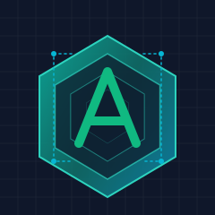

<div align="center">



# AStack

**A modular component framework for building AI applications**

[](LICENSE)
[](https://github.com/qddegtya/astack/pulls)

🚧 **Work in Progress** 🚧

*AStack is under active development but already provides significant value for building AI applications*

</div>

## 📋 Overview

AStack is a modular component framework designed to simplify the development of AI applications through a "everything is a component" philosophy. It provides a zero-adaptation layer design that enables seamless integration between various AI models, tools, and custom business logic.

AStack is an independent technical framework with its own architecture and ecosystem, while being inspired by and technically compatible with [Hlang](https://github.com/hlang-tech) - the revolutionary high-level AI programming language. The framework emphasizes minimalism and performance, allowing developers to create complex systems with minimal boilerplate code while maintaining complete technical autonomy.

### Key Features

- **Component-Based Architecture**: Build complex AI systems by composing simple, reusable components
- **Zero-Adaptation Layer Design**: Components work together without intermediate adaptation layers
- **Pipeline Execution Model**: Support for both independent and pipeline execution modes
- **Extensible Tool System**: Easily integrate new capabilities through a unified tool interface
- **Multi-Model Support**: Seamless integration with various LLM providers
- **Declarative Workflow**: Define complex AI workflows with minimal code
- **Minimalist API Design**: Focus on simplicity and expressiveness

## 👁 Design Philosophy

AStack is built on several core philosophical principles that guide its development:

### Everything is a Component

In AStack, everything from a simple tool to a complex agent is represented as a component. This unified approach simplifies development and promotes code reuse. Components can be composed, extended, and reconfigured to suit various use cases.

### Zero-Adaptation Layer Design

Unlike many frameworks that require adapters or middleware between components, AStack adopts a zero-adaptation layer design. Components can directly interact with each other without intermediate transformation layers, reducing complexity and improving performance.

### Minimalism Over Complexity

AStack prioritizes simple, intuitive APIs over complex abstractions. This minimalist approach leads to more maintainable code and a gentler learning curve.

## 🎯 Use Cases

AStack is particularly well-suited for:

- **AI Agents**: Build autonomous agents that can reason, plan, and execute tasks using tools
- **Content Generation**: Create pipelines for researching, analyzing, and generating high-quality content
- **Data Processing**: Construct workflows for extracting, transforming, and analyzing data
- **Multi-modal Applications**: Develop applications that combine text, images, and other modalities
- **Research Platforms**: Build experimental platforms for AI research and development

## 👏 Inspiration & Comparison

AStack draws inspiration from several outstanding projects in the AI ecosystem, particularly [Haystack](https://github.com/deepset-ai/haystack) by deepset-ai. We express our gratitude to these projects for their pioneering work and contributions to the open-source community.

### AStack vs. Haystack: Feature Comparison

| Feature | AStack | Haystack |
|---------|--------|----------|
| **Core Design** | Everything is a component | Pipeline with nodes |
| **Adaptation Layer** | Zero-adaptation layer design | Requires adapters between components |
| **Primary Focus** | General AI application framework | Primarily NLP and RAG applications |
| **Component Interface** | Unified component interface | Different interfaces for different node types |
| **Agent Support** | First-class agent components with multi-round tool execution | Basic agent support |
| **Memory Management** | Built-in memory abstractions | Limited memory management |
| **Pipeline Execution** | Both independent and pipeline execution modes | Pipeline-focused execution |
| **Tool Integration** | Standardized tool interface | Custom implementations per use case |
| **Model Integration** | Direct model provider integration | Adapter-based integration |
| **Learning Curve** | Minimalist API design | More complex API surface |
| **Performance** | Optimized for direct component interaction | Additional abstraction layers |
| **Customization** | High flexibility with minimal boilerplate | Requires more code for custom components |

Each framework has its strengths and is optimized for different use cases. Haystack excels in RAG applications and document processing, while AStack is designed for broader AI application development with an emphasis on component reusability and minimalist design.

## 🔍 Architecture


## 🚀 Getting Started

### Prerequisites

- Node.js (v18 or higher)
- npm or pnpm

### Installation

```bash
# Clone the repository
git clone https://github.com/qddegtya/astack.git
cd astack

# Install dependencies
pnpm install

# Build the packages
pnpm run build
```

### Examples Directory

AStack includes several examples in the `examples/` directory to demonstrate its capabilities. Each example contains its own README with specific instructions on how to run it with your own API keys and configuration.

## 📚 Examples

### Agent with Tools

This example demonstrates how to create an Agent that can use tools to perform real-world tasks like file operations. It showcases the zero-adaptation layer design principle where components work together without intermediate layers.


This example highlights AStack's ability to handle multi-round tool execution, where the agent can process multiple tool calls within a single conversation, maintaining context throughout the interaction.

### Research Pipeline

This example demonstrates a sophisticated research pipeline that automatically searches for information, analyzes content, and generates comprehensive research reports using AI. It showcases AStack's ability to coordinate complex workflows across multiple components.


The pipeline intelligently coordinates web searches, content extraction, and AI-powered analysis to produce in-depth research reports on any topic, complete with proper citations and structured sections.

## 💻 Code Examples

### Creating a Simple Agent with Tools

```typescript
import { Agent } from '@astack/components';
import { createTool } from '@astack/tools';
import { Deepseek } from '@astack/integrations/model-provider';

// Define tools
const readFileTool = createTool(
  'readFile',
  'Read file contents',
  async ({ filePath }) => {
    // Implementation details
    return fileContents;
  }
);

// Create model provider
const model = new Deepseek({
  apiKey: process.env.DEEPSEEK_API_KEY,
  model: 'deepseek-chat'
});

// Create Agent
const agent = new Agent({
  model,
  tools: [readFileTool],
  systemPrompt: 'You are a helpful assistant that can read files.'
});

// Run the agent
const result = await agent.run('Please read the README.md file');
```

### Building a Pipeline

```typescript
import { Pipeline } from '@astack/core';
import { Agent } from '@astack/components';

// Create pipeline
const pipeline = new Pipeline();

// Add components
pipeline.addComponent('agent', agent);
pipeline.addComponent('resultHandler', new ResultHandler());

// Connect components
pipeline.connect('agent.out', 'resultHandler.in');

// Run pipeline
await pipeline.run('agent.in', 'Please analyze this data');
```

## 🔄 Hlang Compatibility

While AStack is a technically independent framework, it offers seamless compatibility with [Hlang](https://github.com/hlang-tech) - the groundbreaking high-level AI programming language that's revolutionizing how AI applications are built. This technical compatibility offers unique advantages:

### Hlang's Power

[Hlang](https://github.com/hlang-tech) brings several revolutionary concepts to AI development:

- **Declarative AI Programming**: Express complex AI behaviors in a fraction of the code required by traditional methods
- **Human-Centric Design**: Natural language-inspired syntax that dramatically reduces the learning curve
- **Built-In AI Patterns**: Pre-implemented patterns for common AI application architectures
- **Type Safety with Flexibility**: Strong typing system that still allows for the dynamic nature of AI interactions

### Technical Integration

AStack maintains complete technical autonomy while offering compatibility with Hlang:

- **Complementary Architectures**: AStack's component model aligns perfectly with Hlang's conceptual framework
- **Independent Development**: Use AStack on its own or enhance it with Hlang's capabilities
- **Best-of-Both Approach**: Leverage AStack's fine-grained component control with Hlang's high-level abstractions
- **Performance Optimization**: AStack's zero-adaptation layer design ensures efficient execution of Hlang-defined workflows

This technical compatibility creates a powerful combination for developers who want both the elegance of high-level AI programming and the precision of component-based architecture.

## 📦 Packages

AStack is organized into several packages:

- **@astack/core**: Core functionality and pipeline execution engine
- **@astack/components**: Reusable AI components like Agents and Memories
- **@astack/tools**: Tool definitions and implementations
- **@astack/integrations**: Integrations with external services and model providers

## 📖 Documentation

[Documentation coming soon]

For now, please refer to the examples and source code for understanding how to use AStack.

## 🛠️ Development

### Project Structure

```
astack/
├── packages/
│   ├── core/             # Core framework functionality
│   ├── components/       # Reusable components
│   ├── tools/            # Tool implementations
│   └── integrations/     # External integrations
├── examples/             # Example applications
└── docs/                 # Documentation
```

### Contributing

Contributions are welcome! Please feel free to submit a Pull Request.

## 📃 License

This project is licensed under the MIT License - see the [LICENSE](LICENSE) file for details.

## 🙏 Acknowledgements

- Thanks to all contributors who have helped shape AStack
- Inspired by modern AI application architectures and component-based design principles

---

<div align="center">

**AStack** - Building the future of AI applications, one component at a time.

</div>
