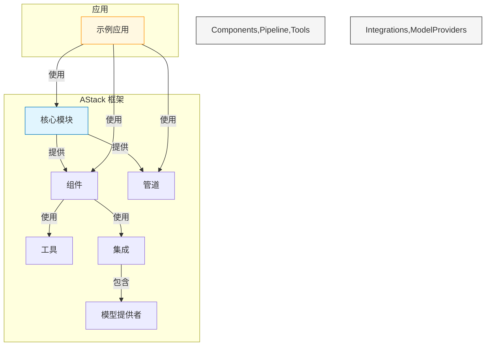
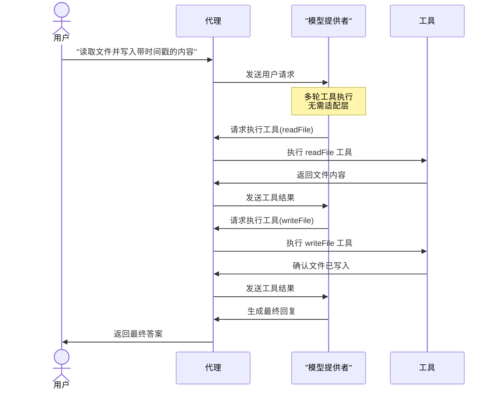
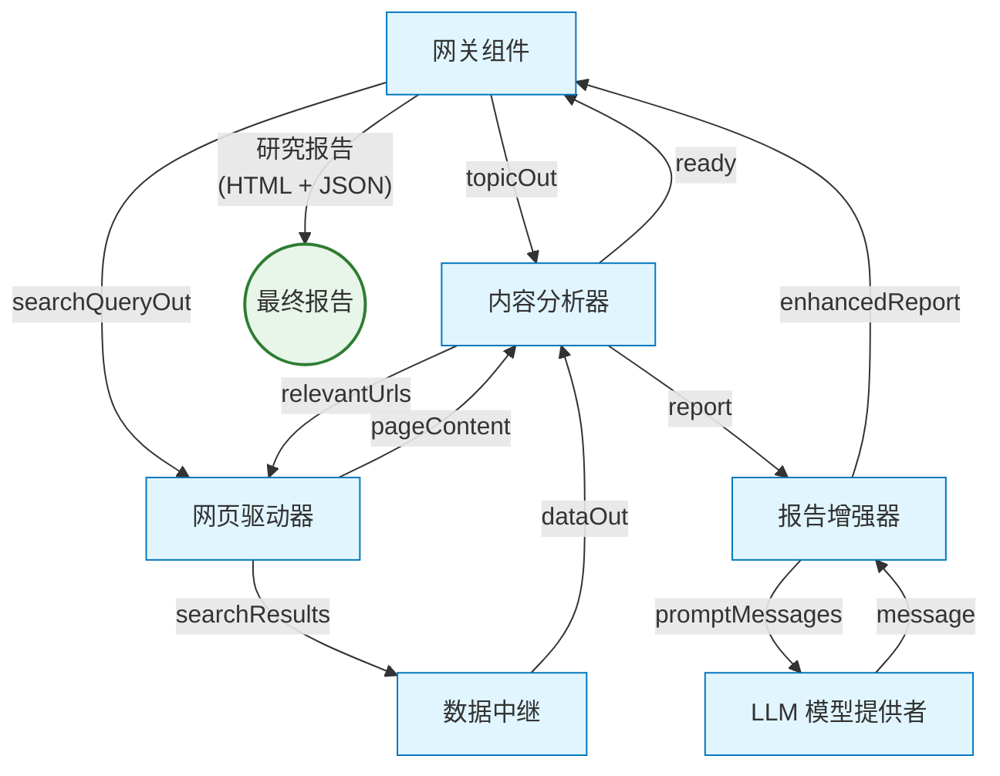

<div align="center">


# AStack

**一个用于构建AI应用的模块化组件框架**

[](LICENSE)
[](https://github.com/qddegtya/astack/pulls)

🚧 **开发中** 🚧

*AStack 正在积极开发中，但已经可以为构建 AI 应用程序提供显著价值*

[English](./README.md) | 简体中文

</div>

## 📋 概述

AStack 是一个模块化组件框架，通过"一切皆组件"的理念简化AI应用的开发。它提供零适配层设计，实现各种 AI 模型、工具和自定义业务逻辑之间的无缝集成。

AStack 是一个具有独立技术架构和生态系统的技术框架，它的灵感来源于革命性的高级 AI 编程语言 [Hlang](https://github.com/hlang-tech)，并在技术上与其兼容。该框架强调极简主义和性能，允许开发者使用最少的样板代码创建复杂系统，同时保持完全的技术自主性。

### 主要特性

- **基于组件的架构**：通过组合简单、可复用的组件构建复杂 AI 系统
- **零适配层设计**：组件之间无需中间适配层即可协同工作
- **管道执行模型**：支持独立和管道两种执行模式
- **可扩展的工具系统**：通过统一的工具接口轻松集成新功能
- **多模型支持**：与各种 LLM 提供商无缝集成
- **声明式工作流**：用最少的代码定义复杂的 AI 工作流
- **极简 API 设计**：专注于简洁性和表达能力

## 👁 设计理念

AStack 基于几个核心哲学原则来指导其开发：

### 一切皆组件

在 AStack 中，从简单的工具到复杂的代理，一切都表示为组件。这种统一的方法简化了开发并促进了代码重用。组件可以被组合、扩展和重新配置以适应各种用例。

### 零适配层设计

与许多需要适配器或中间件的框架不同，AStack 采用零适配层设计。组件可以直接相互交互，无需中间转换层，减少复杂性并提高性能。

### 简约胜于复杂

AStack 优先考虑简单、直观的 API，而非复杂的抽象。这种极简主义方法导致更易于维护的代码和更平缓的学习曲线。

## 🎯 使用场景

AStack 特别适合于：

- **AI 代理**：构建能够推理、规划和使用工具执行任务的自主代理
- **内容生成**：创建用于研究、分析和生成高质量内容的流水线
- **数据处理**：构建用于提取、转换和分析数据的工作流
- **多模态应用**：开发结合文本、图像和其他模态的应用
- **研究平台**：构建用于 AI 研究和开发的实验平台

## 👏 灵感与比较

AStack 从 AI 生态系统中的几个杰出项目汲取灵感，特别是deepset-ai的 [Haystack](https://github.com/deepset-ai/haystack)。我们对这些项目的开创性工作和对开源社区的贡献表示感谢。

值得注意的是，AStack 是用 TypeScript 实现的完全原创框架，而 Haystack 是 Python 实现。AStack 为中文开发者提供完整的中文文档和支持，而 Haystack 缺乏中文文档，对中文用户不够友好。

### AStack vs. Haystack: 功能比较

| 功能 | AStack | Haystack |
|---------|--------|----------|
| **核心设计** | 一切皆组件 | 带节点的管道 |
| **适配层** | 零适配层设计 | 需要组件间适配器 |
| **主要焦点** | 通用 AI 应用框架 | 主要针对 NLP 和 RAG 应用 |
| **组件接口** | 统一的组件接口 | 不同节点类型有不同接口 |
| **代理支持** | 一流的代理组件，支持多轮工具执行 | 基础代理支持 |
| **内存管理** | 内置内存抽象 | 有限的内存管理 |
| **管道执行** | 同时支持独立和管道执行模式 | 以管道为中心的执行 |
| **工具集成** | 标准化工具接口 | 针对用例的自定义实现 |
| **模型集成** | 直接模型提供者集成 | 基于适配器的集成 |
| **学习曲线** | 极简 API 设计 | 更复杂的 API 表面 |
| **性能** | 针对直接组件交互优化 | 额外的抽象层 |
| **定制化** | 高灵活性，最少样板代码 | 自定义组件需要更多代码 |
| **语言实现** | TypeScript | Python |
| **中文支持** | 完整中文文档和支持 | 无中文文档 |

每个框架都有其优势，并针对不同的用例进行了优化。Haystack 在 RAG 应用和文档处理方面表现出色，而 AStack 则专为更广泛的 AI 应用开发而设计，强调组件可重用性和极简设计。

## 🔍 架构



## 🚀 快速开始

### 前提条件

- Node.js (v18 或更高版本)
- npm 或 pnpm

### 安装

```bash
# 克隆仓库
git clone https://github.com/qddegtya/astack.git
cd astack

# 安装依赖
pnpm install

# 构建包
pnpm run build
```

### 示例目录

AStack 在 `examples/` 目录中包含了几个示例，用于展示其功能。每个示例都包含自己的 README，其中有关于如何使用您自己的 API 密钥和配置运行它的具体说明。

## 📚 示例

### 带工具的代理

此示例演示如何创建一个可以使用工具执行文件操作等实际任务的代理。它展示了零适配层设计原则，让组件无需中间层即可协同工作。



此示例突出了 AStack 处理多轮工具执行的能力，代理可以在单个对话中处理多个工具调用，在整个交互过程中保持上下文。

### 研究管道

此示例演示了一个复杂的研究管道，它可以自动搜索信息、分析内容并使用 AI 生成全面的研究报告。它展示了 AStack 协调多个组件之间复杂工作流的能力。



该管道智能地协调网络搜索、内容提取和 AI 驱动的分析，以生成关于任何主题的深入研究报告，包括适当的引用和结构化部分。

## 💻 代码示例

### 创建带工具的简单代理

```typescript
import { Agent } from '@astack/components';
import { createTool } from '@astack/tools';
import { Deepseek } from '@astack/integrations/model-provider';

// 定义工具
const readFileTool = createTool(
  'readFile',
  '读取文件内容',
  async ({ filePath }) => {
    // 实现细节
    return fileContents;
  }
);

// 创建模型提供者
const model = new Deepseek({
  apiKey: process.env.DEEPSEEK_API_KEY,
  model: 'deepseek-chat'
});

// 创建代理
const agent = new Agent({
  model,
  tools: [readFileTool],
  systemPrompt: '你是一个可以读取文件的助手。'
});

// 运行代理
const result = await agent.run('请读取README.md文件');
```

### 构建管道

```typescript
import { Pipeline } from '@astack/core';
import { Agent } from '@astack/components';

// 创建管道
const pipeline = new Pipeline();

// 添加组件
pipeline.addComponent('agent', agent);
pipeline.addComponent('resultHandler', new ResultHandler());

// 连接组件
pipeline.connect('agent.out', 'resultHandler.in');

// 运行管道
await pipeline.run('agent.in', '请分析这些数据');
```

## 🔄 Hlang 兼容性

虽然 AStack 是一个技术上独立的框架，但它提供与 [Hlang](https://github.com/hlang-tech) 的无缝兼容性——Hlang 是一种革命性的高级 AI 编程语言，正在彻底改变 AI 应用的构建方式。这种技术兼容性提供了独特的优势：

### Hlang 的力量

[Hlang](https://github.com/hlang-tech) 为AI开发带来了几个革命性的概念：

- **声明式 AI 编程**：用传统方法所需代码的一小部分表达复杂的 AI 行为
- **以人为中心的设计**：受自然语言启发的语法，大幅降低学习曲线
- **内置 AI 模式**：常见 AI 应用架构的预实现模式
- **带灵活性的类型安全**：强类型系统，同时允许 AI 交互的动态性质

### 技术集成

AStack 保持完全的技术自主性，同时提供与 Hlang 的兼容性：

- **互补架构**：AStack 的组件模型与 Hlang 的概念框架完美对齐
- **独立开发**：独立使用 AStack 或用 Hlang 的功能增强它
- **双重优势方法**：利用 AStack 的细粒度组件控制和 Hlang 的高级抽象
- **性能优化**：AStack 的零适配层设计确保 Hlang 定义的工作流高效执行

这种技术兼容性为那些既想要高级AI编程的优雅又想要基于组件架构精确控制的开发者创造了强大的组合。

## 📦 包结构

AStack 组织为几个包：

- **@astack/core**: 核心功能和管道执行引擎
- **@astack/components**: 可重用的 AI 组件，如代理和内存
- **@astack/tools**: 工具定义和实现
- **@astack/integrations**: 与外部服务和模型提供者的集成

## 📖 文档

[文档即将推出]

目前，请参考示例和源代码来了解如何使用 AStack。

## 🛠️ 开发

### 项目结构

```
astack/
├── packages/
│   ├── core/             # 核心框架功能
│   ├── components/       # 可重用组件
│   ├── tools/            # 工具实现
│   └── integrations/     # 外部集成
├── examples/             # 示例应用
└── docs/                 # 文档
```

### 贡献

欢迎贡献！请随时提交 Pull Request。

## 📃 许可证

本项目基于 MIT 许可证 - 详情请参阅 [LICENSE](LICENSE) 文件。

## 🙏 致谢

- 感谢所有帮助塑造 AStack 的贡献者
- 受现代 AI 应用架构和基于组件的设计原则启发

---

<div align="center">

**AStack** - 一次一个组件，构建 AI 应用的未来。

</div>
