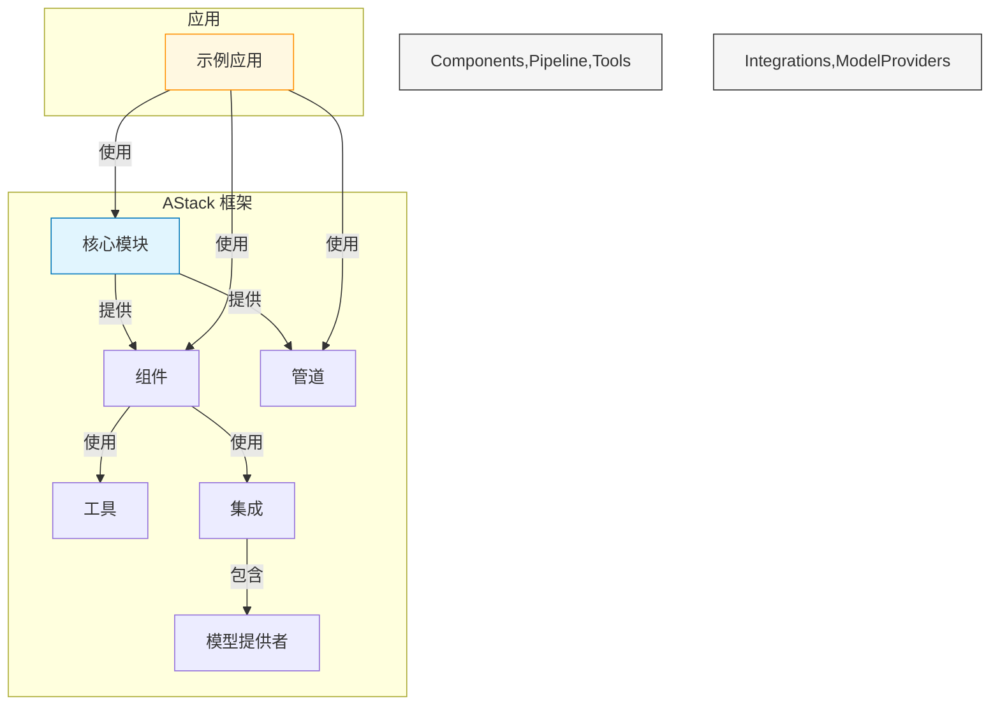
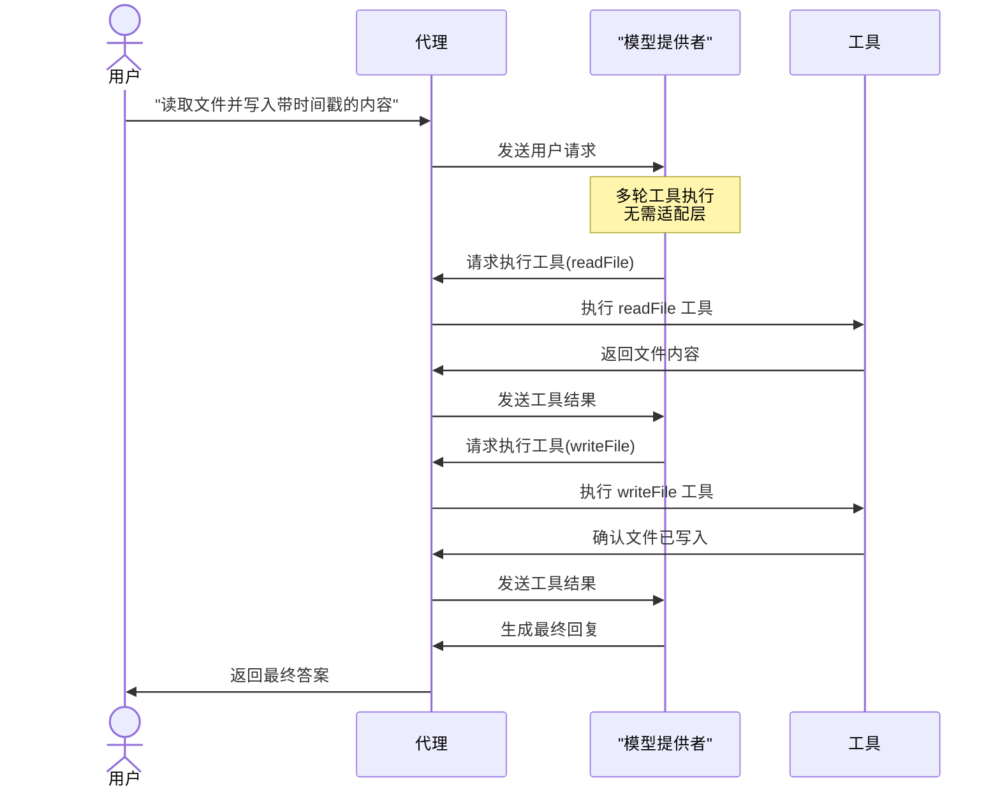
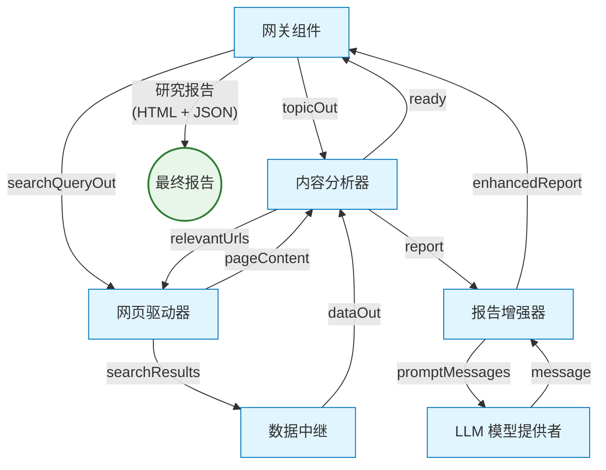
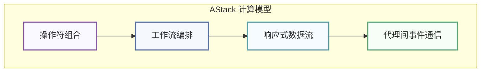
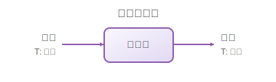
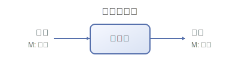
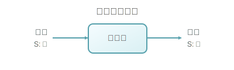
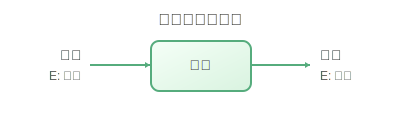
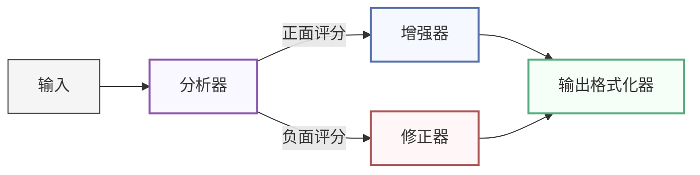
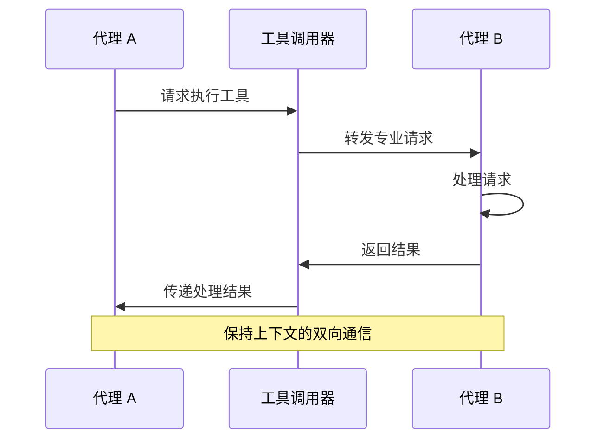

<div align="center">


# AStack

**一个用于构建 AI 应用的可组合框架**

[](LICENSE)
[](https://github.com/astack-tech/astack/pulls)
[](https://deepwiki.com/astack-tech/astack)

🎉 **Beta 版本已发布** 🎉

*AStack 正在积极开发中，但已经可以为构建 AI 应用程序提供显著价值*

[English](./README.md) | 简体中文

</div>

## 📋 概述

AStack 是一个可组合框架，通过"一切皆组件"的理念简化 AI 应用的开发。它提供零适配层设计，实现各种 AI 模型、工具和自定义业务逻辑之间的无缝集成。

AStack 是一个具有独立技术架构和生态系统的技术框架，构建在 [Hlang](https://github.com/hlang-tech) 之上。Hlang 是一种高度语义化的[第四代编程语言（4GL）](https://en.wikipedia.org/wiki/Fourth-generation_programming_language)，受到流程基础编程（Flow-Based Programming）范式启发，特别适用于作为计算模型以及被 AI 生成。正是这种基于 Hlang 的基础赋予了 AStack 强大的能力。该框架强调极简主义和性能，允许开发者使用最少的样板代码创建复杂系统，同时保持完全的技术自主性。

### 主要特性

- **基于组件的架构**：通过组合简单、可复用的组件构建复杂 AI 系统
- **零适配层设计**：组件之间无需中间适配层即可协同工作
- **管道执行模型**：支持独立和管道两种执行模式
- **可扩展的工具系统**：通过统一的工具接口轻松集成新功能
- **多模型支持**：与各种 LLM 提供商无缝集成
- **声明式工作流**：用最少的代码定义复杂的 AI 工作流
- **极简 API 设计**：专注于简洁性和表达能力

## 👁 设计理念

AStack 基于几个核心哲学原则来指导其开发：

### 一切皆组件

在 AStack 中，从简单的工具到复杂的代理，一切都表示为组件。这种统一的方法简化了开发并促进了代码重用。组件可以被组合、扩展和重新配置以适应各种用例。

### 零适配层设计

与许多需要适配器或中间件的框架不同，AStack 采用零适配层设计。组件可以直接相互交互，无需中间转换层，减少复杂性并提高性能。

### 简约胜于复杂

AStack 优先考虑简单、直观的 API，而非复杂的抽象。这种极简主义方法导致更易于维护的代码和更平缓的学习曲线。

## 🎯 使用场景

AStack 特别适合于：

- **AI 代理**：构建能够推理、规划和使用工具执行任务的自主代理
- **内容生成**：创建用于研究、分析和生成高质量内容的流水线
- **数据处理**：构建用于提取、转换和分析数据的工作流
- **多模态应用**：开发结合文本、图像和其他模态的应用
- **研究平台**：构建用于 AI 研究和开发的实验平台

## 👏 灵感与比较

AStack 从 AI 生态系统中的几个杰出项目汲取灵感，特别是 deepset-ai 的 [Haystack](https://github.com/deepset-ai/haystack)。我们对这些项目的开创性工作和对开源社区的贡献表示感谢。

值得注意的是，AStack 是用 TypeScript 实现的完全原创框架，而 Haystack 是 Python 实现。AStack 为中文开发者提供完整的中文文档和支持，而 Haystack 缺乏中文文档，对中文用户不够友好。

### AStack vs. Haystack: 功能比较

> 此比较基于 Haystack v2.0（2025 年 5 月版本）。两个框架都在持续发展，特定功能可能会随时间变化。

| 功能 | AStack | Haystack |
|---------|--------|----------|
| **核心设计** | 一切皆组件 | 带节点的管道 |
| **适配层** | 零适配层设计 | 组件连接通常需要适配器 |
| **主要焦点** | 通用 AI 应用框架 | 主要针对 NLP 和 RAG 应用 |
| **组件接口** | 统一的组件接口 | 基于组件类型的不同接口 |
| **代理支持** | 支持复合代理系统 | 支持复合代理系统 |
| **内存管理** | 内置内存抽象 | 通过专用组件实现的内存 |
| **执行模式** | 同时支持独立和管道执行 | 同时支持管道和组件级执行 |
| **工具集成** | 标准化工具接口 | 根据用例的不同集成模式 |
| **模型集成** | 直接模型提供者集成 | 提供者特定的适配器 |
| **学习曲线** | 专注简洁性的极简 API | 全面但更复杂的 API |
| **定制化** | 高灵活性，最少样板代码 | 灵活但需要更多实现代码 |
| **语言实现** | **TypeScript** | **Python** |
| **中文支持** | **完整中文文档** | **有限的中文文档** |

每个框架都有其优势，并针对不同的用例进行了优化。Haystack 在 RAG 应用和文档处理方面表现出色，拥有成熟的 Python 生态系统，而 AStack 专为 TypeScript/JavaScript 环境设计，强调组件可重用性和极简设计原则。AStack 还提供完整的中文文档，使其对中文开发者特别友好。

## 🔍 架构



## 🚀 快速开始

### 前提条件

- Node.js (v18 或更高版本)
- npm 或 pnpm

### 安装

```bash
# 克隆仓库
git clone https://github.com/astack-tech/astack.git
cd astack

# 安装依赖
pnpm install

# 构建包
pnpm run build
```

### 示例目录

AStack 在 `examples/` 目录中包含了几个示例，用于展示其功能。每个示例都包含自己的 README，其中有关于如何使用您自己的 API 密钥和配置运行它的具体说明。

## 📚 示例

### 带工具的代理

此示例演示如何创建一个可以使用工具执行文件操作等实际任务的代理。它展示了零适配层设计原则，让组件无需中间层即可协同工作。



此示例突出了 AStack 处理多轮工具执行的能力，代理可以在单个对话中处理多个工具调用，在整个交互过程中保持上下文。

### 研究管道

此示例演示了一个复杂的研究管道，它可以自动搜索信息、分析内容并使用 AI 生成全面的研究报告。它展示了 AStack 协调多个组件之间复杂工作流的能力。



该管道智能地协调网络搜索、内容提取和 AI 驱动的分析，以生成关于任何主题的深入研究报告，包括适当的引用和结构化部分。

## 💻 代码示例

### 创建带工具的简单代理

```typescript
import { Agent } from '@astack-tech/components';
import { createTool } from '@astack-tech/tools';
import { Deepseek } from '@astack-tech/integrations/model-provider';

// 定义工具
const readFileTool = createTool(
  'readFile',
  '读取文件内容',
  async ({ filePath }) => {
    // 实现细节
    return fileContents;
  }
);

// 创建模型提供者
const model = new Deepseek({
  apiKey: process.env.DEEPSEEK_API_KEY,
  model: 'deepseek-chat'
});

// 创建代理
const agent = new Agent({
  model,
  tools: [readFileTool],
  systemPrompt: '你是一个可以读取文件的助手。'
});

// 运行代理
const result = await agent.run('请读取 README.md 文件');
```

### 构建管道

AStack 重构后的 Pipeline 提供了智能执行和三种灵活模式：

```typescript
import { Pipeline } from '@astack-tech/core';
import { TextSplitter, Embedder, VectorStore } from '@astack-tech/components';

// 创建管道
const pipeline = new Pipeline();

// 添加组件
pipeline.addComponent('splitter', new TextSplitter());
pipeline.addComponent('embedder', new Embedder());
pipeline.addComponent('store', new VectorStore());

// 连接组件 - 直接端口连接
pipeline.connect('splitter.out', 'embedder.in');
pipeline.connect('embedder.out', 'store.in');

// 模式 1: 自动推断端点（检测单个叶子端口）
const result = await pipeline.run('splitter.in', document);

// 模式 2: 显式指定端点
const result = await pipeline.run('splitter.in', document, 'store.out');

// 模式 3: 多输出收集（类型安全）
const results = await pipeline.run('splitter.in', document, {
  includeOutputsFrom: ['embedder.out', 'store.out']
});
// 返回: { 'embedder.out': T, 'store.out': T }
```

**Pipeline 特性：**
- **智能拓扑优化**：每个路由只构建一次拓扑，后续执行复用
- **三种执行模式**：自动推断、显式端点或多输出收集
- **类型安全的多输出**：完整的 TypeScript 类型推断支持
- **并发执行**：Resolver 队列管理多个并发管道运行
```

## 🔄 Hlang 兼容性

虽然 AStack 是一个技术上独立的框架，但它提供与 [Hlang](https://github.com/hlang-tech) 的无缝兼容性——Hlang 是一个受基于流程编程（Flow-Based Programming, FBP）范式启发的框架，其特性特别适合 AI 应用开发。这种技术兼容性提供了独特的优势：

### Hlang 的独特特性

[Hlang](https://github.com/hlang-tech) 提供了几个对现代软件开发有价值的独特概念，特别是对 AI 应用：

- **声明式编程方法**：用传统方法所需代码的一小部分表达复杂行为
- **以人为中心的设计**：直觉的语法，降低开发者的学习曲线
- **基于组件的架构**：围绕组件构建，可组装成复杂系统
- **带灵活性的类型安全**：强类型系统，同时适应现代应用的动态特性

### 技术集成

AStack 保持完全的技术自主性，同时提供与 Hlang 的兼容性：

- **兼容的组件模型**：AStack 的组件方法在结构上与 Hlang 的基于流程编程模型兼容
- **独立开发**：AStack 可以独立使用或与 Hlang 的功能结合使用
- **互补优势**：结合 AStack 的细粒度组件控制与 Hlang 的高级抽象
- **高效执行**：AStack 的零适配层设计使得在任一框架中定义的工作流都能高效实现

这种技术兼容性为开发者创造了实用的协同效应，既能利用两个框架的优势，又能保持各系统的独立性。

## 🧩 强大的计算模型

AStack 实现了一种基于 Hlang 启发的单子函数式编程范式的复杂计算模型。这种模型提供了强大的抽象，使复杂工作流、响应式系统和组合架构能够在保持简单性和灵活性的同时得以实现。

### 四种核心计算模式

AStack 的计算模型围绕四种强大的模式构建，这些模式可以组合起来创建复杂的 AI 应用：



| 计算模式 | 描述 | 图示 |
|-----------|------------|--------|
| **操作符组合** | 每个组件都是一个具有纯函数接口的可组合变换操作符。组件保持清晰的输入/输出契约，可以无缝链接在一起。 |  |
| **工作流编排** | 组件可以被编排成具有分支、汇合和条件执行路径的复杂工作流，支持动态路由和并行处理。 |  |
| **响应式数据流** | 实现事件驱动的异步数据处理模型，组件响应数据事件而非被动轮询，支持背压处理。 |  |
| **代理间事件通信** | 支持代理之间的复杂交互和消息传递，在多次交换中保持上下文连续性，实现多代理协调。 |  |

#### 1. 操作符组合

AStack 的基本构建块是操作符组合，每个组件都是一个可以与其他组件组合的变换操作符。

```typescript
// 简单的操作符组合示例
const textProcessor = new TextProcessor();
const sentimentAnalyzer = new SentimentAnalyzer();

// 将 textProcessor 的输出连接到 sentimentAnalyzer 的输入
pipeline.connect('textProcessor.out', 'sentimentAnalyzer.in');
```

| 特性 | 描述 |
|---------|-------------|
| **函数纯粹性** | 组件被设计为具有明确输入和输出的纯变换 |
| **组合模式** | 组件可以链接在一起，其输出作为其他组件的输入 |
| **类型安全** | 端口系统确保连接组件之间的类型兼容性 |
| **透明数据流** | 组件间的数据流是显式和可追踪的 |

#### 2. 工作流编排

组件可以被编排成具有分支、汇合和条件执行路径的复杂工作流。



| 特性 | 描述 |
|---------|-------------|
| **动态路由** | 数据可以基于内容或元数据在组件之间条件性路由 |
| **并行处理** | 多个路径可以同时执行以提高处理效率 |
| **管道构建** | 复杂工作流可以增量构建并在运行时修改 |
| **错误处理** | 内置机制用于处理工作流中的错误并从中恢复 |

#### 3. 响应式数据流

AStack 实现了一种响应式编程模型，数据在响应事件或变化时通过系统流动。

```typescript
// 响应式组件示例
class ReactiveProcessor extends Component {
  constructor() {
    super({});
    Component.Port.I('in').attach(this);
    Component.Port.O('out').attach(this);
  }

  _transform($i, $o) {
    // 监听输入端口的数据
    $i('in').receive(data => {
      // 响应式处理数据
      const result = this.process(data);
      // 发送到输出端口
      $o('out').send(result);
    });
  }
}
```

| 特性 | 描述 |
|---------|-------------|
| **事件驱动** | 组件响应数据事件而不是被主动轮询 |
| **异步处理** | 非阻塞操作允许高效利用资源 |
| **背压处理** | 流量控制机制防止下游组件过载 |
| **热流与冷流** | 支持持久（热）和按需（冷）数据流 |

#### 4. 代理间事件通信

AStack 超越简单的数据管道，实现复杂的代理间通信模式。



| 特性 | 描述 |
|---------|-------------|
| **上下文保存** | 通信在多次交换中维持上下文 |
| **多代理协调** | 代理可以通过结构化交互协作完成复杂任务 |
| **工具集成** | 将外部工具和服务无缝集成到代理通信中 |
| **状态管理** | 可选的有状态交互以维护对话历史 |

### 单子设计模式

所有这些模式的基础是源自函数式编程的单子设计方法：

- **封装状态**：每个组件维护自己的隔离状态
- **可链式操作**：操作可以在流畅接口中链接在一起
- **可组合变换**：复杂变换由简单、可组合的单元构建
- **错误传播**：错误以受控方式通过链传播

这种单子方法使 AStack 既能保持函数式编程的灵活性，又能获得基于组件开发的实际好处。

## 📦 包结构

AStack 组织为几个包，均已发布到 npm：

| 包名 | 版本 | 描述 |
|------|------|------|
| [@astack-tech/core](https://www.npmjs.com/package/@astack-tech/core) | [](https://www.npmjs.com/package/@astack-tech/core) | 核心功能和管道执行引擎 |
| [@astack-tech/components](https://www.npmjs.com/package/@astack-tech/components) | [](https://www.npmjs.com/package/@astack-tech/components) | 可重用的 AI 组件，如代理和内存 |
| [@astack-tech/tools](https://www.npmjs.com/package/@astack-tech/tools) | [](https://www.npmjs.com/package/@astack-tech/tools) | 工具定义和实现 |
| [@astack-tech/integrations](https://www.npmjs.com/package/@astack-tech/integrations) | [](https://www.npmjs.com/package/@astack-tech/integrations) | 与外部服务和模型提供者的集成 |

### 安装

安装你需要的包：

```bash
# 核心包（必需）
npm install @astack-tech/core@beta

# 组件包（用于 Agent、Memory 等）
npm install @astack-tech/components@beta

# 工具包（用于工具实现）
npm install @astack-tech/tools@beta

# 集成包（用于 OpenAI、Deepseek 等模型提供者）
npm install @astack-tech/integrations@beta
```

或一次性安装所有包：

```bash
npm install @astack-tech/core@beta @astack-tech/components@beta @astack-tech/tools@beta @astack-tech/integrations@beta
```


## 📖 文档

[文档即将推出]

目前，请参考示例和源代码来了解如何使用 AStack。

## 🛠️ 开发

### 项目结构

```
astack/
├── packages/
│   ├── core/             # 核心框架功能
│   ├── components/       # 可重用组件
│   ├── tools/            # 工具实现
│   └── integrations/     # 外部集成
├── examples/             # 示例应用
└── docs/                 # 文档
```

### 贡献

欢迎贡献！请查看 [CONTRIBUTING.md](./.github/CONTRIBUTING.md) 获取详细指南。

要点：
- 我们使用 `dev` 分支进行活跃开发和新功能
- `master` 分支保留用于稳定发布
- 所有 Pull Request 应该针对 `dev` 分支

请按照我们的指南随时提交 Pull Request。

## 📃 许可证

本项目基于 MIT 许可证 - 详情请参阅 [LICENSE](LICENSE) 文件。

## 🙏 致谢

- 感谢所有帮助塑造 AStack 的贡献者
- 受现代 AI 应用架构和基于组件的设计原则启发

---

<div align="center">

**AStack** - 一次一个组件，构建 AI 应用的未来。

</div>
