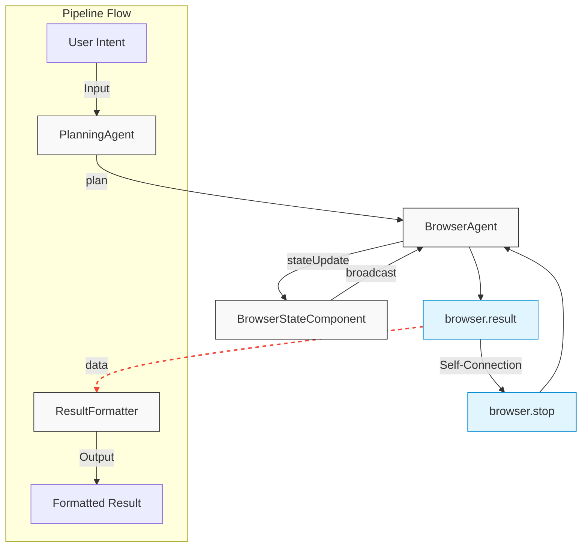

# Browser Use Example

This example demonstrates how to use AStack to build a browser automation pipeline that can understand natural language intents, execute web browsing tasks, and return formatted results.

## Overview

The Browser Use example showcases:

1. Natural language task planning using an LLM-powered agent
2. Browser automation with Playwright
3. State management for tracking browser context
4. Result formatting for structured output
5. Automatic resource cleanup
6. Pipeline-based execution flow

## Pipeline Architecture

The pipeline consists of several components working together:



### Component Responsibilities

- **PlanningAgent**: Converts natural language intent into a step-by-step plan for browser automation
- **BrowserAgent**: Executes browser automation actions using Playwright
- **BrowserStateComponent**: Manages and broadcasts browser state (DOM, URL, etc.) to other components
- **ResultFormatter**: Formats raw data from browser operations into structured, readable cards

### Data Flow

1. User intent is sent to the `PlanningAgent`
2. `PlanningAgent` creates a plan and sends it to `BrowserAgent`
3. `BrowserAgent` executes browser actions and sends state updates to `BrowserStateComponent`
4. `BrowserStateComponent` broadcasts state to interested components
5. `BrowserAgent` sends result data to `ResultFormatter` and signals itself to close
6. `ResultFormatter` creates a structured card output
7. Pipeline returns the formatted result

## Usage

```bash
# Install dependencies
pnpm install

# Run the example with a custom query
DEEPSEEK_API_KEY=your_api_key pnpm start "your query here"

# Or use the default query
DEEPSEEK_API_KEY=your_api_key pnpm start
```

## Key Design Patterns

- **"Everything is a Component" Principle**: All functionality is encapsulated in composable components
- **Zero-Adapter Design**: Components communicate directly through ports without adapters
- **Automatic Resource Management**: Browser resources are automatically cleaned up after task completion
- **Declarative Pipeline Configuration**: Components and connections are defined declaratively

## Extending the Example

You can extend this example by:

1. Adding new browser tools (e.g., form filling, file downloads)
2. Implementing error recovery strategies
3. Adding authentication support
4. Creating specialized components for specific websites
5. Adding visualization for real-time monitoring
